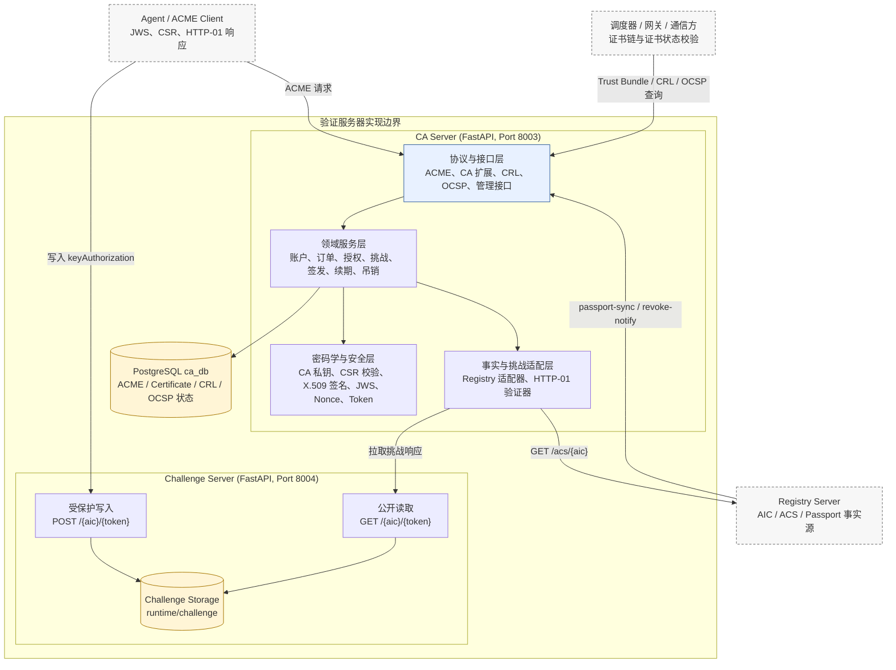
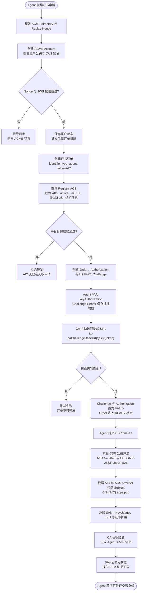
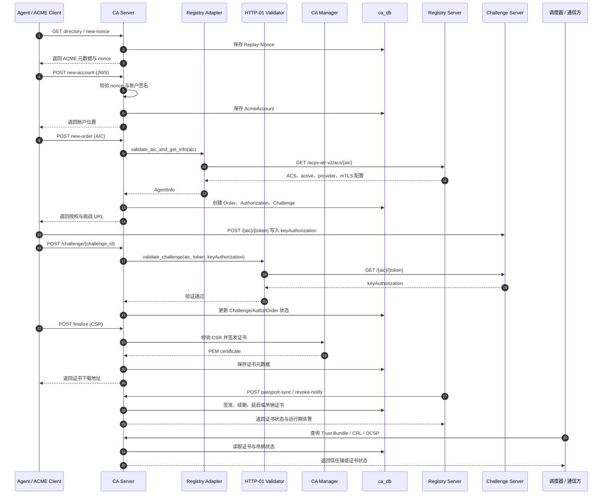
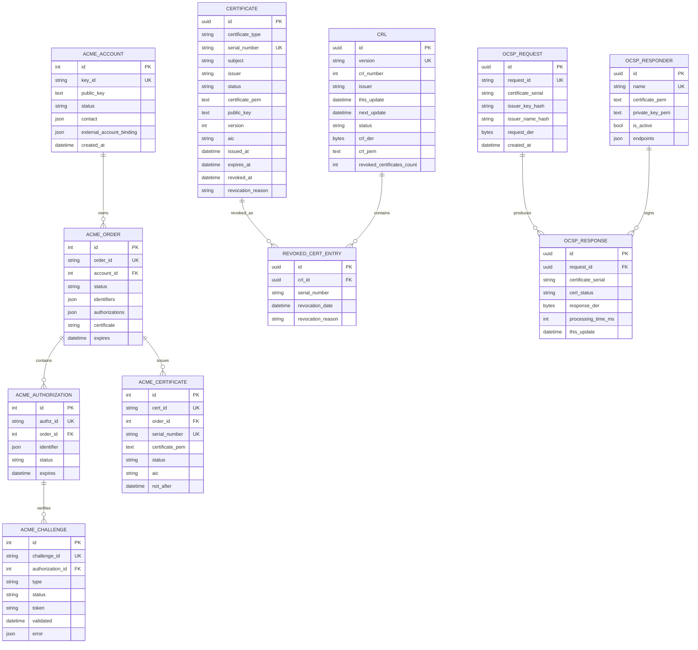

# 验证服务器实现

验证服务器是 RenTA 智能体互联网交易平台中负责可信身份验证与证书生命周期管理的核心模块。面向智能体之间的发现、委托、交易和协作场景，平台不仅需要知道“某个智能体已经被注册”，还需要在后续通信和交易调度过程中持续确认“该智能体身份是否真实、服务端点是否可控、证书状态是否仍然有效”。因此，本作品在 Registry Server 保存智能体登记事实的基础上，进一步设计并实现验证服务器，将 AIC、ACS、Passport、HTTP-01 挑战和 X.509 数字证书连接成一条可自动申请、可密码学验证、可吊销追溯的信任链。

在系统实现中，验证服务器由 CA Server 和 Challenge Server 两部分构成。CA Server 是证书签发与状态发布核心，负责执行 ACME 风格的证书申请流程，校验 Registry Server 中的 AIC 与 ACS 信息，签发 Agent 证书，并提供 Trust Bundle、CRL、OCSP 和管理接口；Challenge Server 是端点控制权验证子服务，负责托管 HTTP-01 挑战响应，使 CA Server 能够主动验证申请者是否控制其在 ACS 中声明的挑战端点。Registry Server、Orchestrator 等模块在本节中只作为上游事实源或下游证书使用方出现，不展开其自身实现。

本节围绕验证服务器的功能定位、实施环境、总体架构、核心流程、模块实现、数据设计和运行效果展开说明。配图主要采用架构图、流程图、时序图和数据模型图，用于说明验证服务器内部的模块边界、证据流转和状态变化关系。

## （一）建设目标与功能定位

在智能体交易平台中，身份可信是后续能力发现、自动编排和交易协作的基础。传统的注册表只能说明某个 Agent 曾经提交过登记信息，但无法直接证明调用方当前控制该 Agent 的服务端点，也无法在 Agent 被暂停、删除或风险升高后向通信方及时传播失效状态。针对这一问题，验证服务器的建设目标是把平台审核结果转化为可被通信协议和调度系统验证的数字证书身份。

验证服务器在作品中的功能定位可以概括为“智能体交易身份的证书化验证中心”。它不负责 Agent 注册、任务调度或业务交易本身，而是为这些环节提供可验证的身份凭据、端点控制权证明、吊销状态和信任锚。其主要建设目标如下：

1. 为通过平台审核的 Agent 建立唯一、可验证、可撤销的证书身份。
2. 将 AIC 与 X.509 证书绑定，使证书 CN、SAN 与平台登记身份保持一致。
3. 使用 HTTP-01 机制验证申请方对 ACS 中声明端点的控制权，避免仅凭自报信息签发证书。
4. 将 Passport 状态与证书生命周期联动，实现审核通过后签发、状态异常后暂缓或吊销、证书临期时续期轮换。
5. 向 Agent、网关、交易调度器和外部验证方提供 Trust Bundle、CRL、OCSP 等标准验证能力。

通过上述设计，RenTA 中的智能体不只是“在平台注册表中存在记录”，而是能够获得由平台 CA 签发、可被通信系统校验、可随运行状态变化而撤销的数字身份。该模块体现了作品在可信注册、可信通信和运行期风控联动方面的工程实现能力。

## （二）软硬件实施环境

验证服务器采用容器化微服务方式部署，当前联调环境位于远端 `~/team_ws/sds`。部署节点为 Ubuntu 24.04.3 LTS on WSL2，x86_64 架构，Intel Core i9-14900K，32 个逻辑 CPU，约 15 GiB 内存，约 1 TB 本地磁盘。该环境能够支撑作品演示、跨服务联调、集成测试和中等规模并发验证。

软件技术选型如下表所示：

| 层次 | 技术选型 | 在作品中的作用 |
|---|---|---|
| Web 服务 | FastAPI, Uvicorn | 提供 ACME、CA 扩展、CRL、OCSP、管理与健康检查接口 |
| 数据建模 | Pydantic V2, SQLModel, SQLAlchemy | 完成请求校验、领域模型定义和数据库访问 |
| 数据库 | PostgreSQL 16 | 保存 ACME 状态、证书元数据、吊销记录和 OCSP 审计数据 |
| 密码学能力 | Python cryptography | 加载或生成 CA 证书与私钥，校验 CSR，签发 X.509 证书，生成 CRL/OCSP 响应 |
| 协议标准 | ACME, X.509, CRL, OCSP | 支撑自动化证书申请、证书身份表达、吊销传播和实时状态查询 |
| 工程部署 | Docker Compose, Alembic, pytest | 实现服务编排、数据库迁移和自动化测试验收 |

服务通过 Docker Compose 编排运行，主要容器包括 `sds-ca`、`sds-challenge`、`sds-registry` 和 `sds-postgres`。其中，`sds-ca` 对外暴露端口 `8003`，提供 CA Server 能力；`sds-challenge` 对外暴露端口 `8004`，提供 Challenge Server 能力；`sds-registry` 通过 `18001 -> 8001` 暴露，为验证服务器提供 AIC、ACS 与 Passport 事实源；PostgreSQL 通过端口 `5432` 保存 CA 侧状态数据。当前演示环境中，CA Server 通过 `AGENT_REGISTRY_URL=http://registry-server:8001/acps-atr-v2` 对接 Registry，通过内部服务令牌保护跨服务调用；Challenge Server 使用 `CHALLENGE_WRITE_TOKEN` 保护挑战写入接口，并限制挑战响应最大长度为 4096 字节。Challenge Server 代码中的读写路由为 `/{agent_aic}/{token}`，部署时由 `BASE_URL=/acps-atr-v2` 统一形成 ATR 访问前缀。

## （三）总体实施架构

验证服务器采用“核心 CA 服务 + 挑战验证子服务 + 平台事实源接入 + 持久化状态库”的集成架构。CA Server 负责证书申请、身份校验、证书签发和状态发布；Challenge Server 负责承载 HTTP-01 挑战响应；Registry Server 提供平台登记事实；PostgreSQL 保存证书申请、签发、吊销和查询过程中的结构化状态。

图 1 验证服务器总体实施架构图。

如图 1 所示，验证服务器位于 Registry 侧注册审核结果与后续证书使用方之间。Registry Server 证明“该 AIC 来自平台注册并处于可用状态”；Challenge Server 承载 HTTP-01 挑战响应，证明“申请者可以控制该智能体声明的挑战端点”；CA Server 将平台身份事实、端点控制权证明和证书签名过程组织为完整的证书申请流程；PostgreSQL 则保证每次申请、验证、签发、续期、吊销和状态查询均可追溯。

该架构的优势在于职责边界清晰。CA Server 不直接信任客户端自报的身份字段，而是通过 Registry 适配器读取 ACS 与 Passport 事实；Challenge Server 不参与证书签名，只负责受保护地存储挑战响应并公开读取；证书使用方不需要理解 Registry 的内部审核逻辑，只需要通过 Trust Bundle、CRL 或 OCSP 即可判断证书链和证书状态。由此，平台注册事实被转换成标准化、可复用的密码学验证能力。

## （四）核心实施流程

验证服务器的核心流程是智能体证书验证与签发。该流程借鉴 ACME 自动化证书申请思想，但将传统域名标识替换为平台定义的 Agent 标识 AIC，并在签发前引入 ACS、Passport 和端点控制权校验。

图 2 智能体证书验证与签发流程图。

如图 2 所示，证书申请不是简单的“提交 CSR 即签发”，而是需要同时通过账户签名、平台身份、端点控制权和密钥强度校验。CA Server 首先通过 Replay-Nonce 与 JWS 验证请求来源和防重放能力；随后根据 AIC 调用 Registry Server 获取 ACS，确认 Agent 处于 active 状态，并检查其是否提供 mTLS 所需的挑战地址和组织信息；在挑战验证阶段，CA Server 主动访问 Challenge Server 中的 keyAuthorization，确认申请方确实控制对应端点；最后，CA Server 根据平台事实构造证书 Subject 与 SAN，并使用 CA 私钥签发 Agent 证书。

从业务逻辑上看，该流程可以概括为“先验身份、再验端点、最后签发证书”。身份校验用于确认 AIC 来自平台注册事实，端点校验用于确认申请者控制 ACS 声明的服务地址，证书签发用于把上述验证结果固化为可被通信协议识别的 X.509 凭据。该设计既符合证书自动化签发的工程习惯，也适配智能体互联网中“主体可发现、能力可描述、身份可验证”的业务需求。

## （五）关键交互与集成方法

验证服务器通过标准 HTTP API 与外部模块集成。对 Agent 侧，它表现为 ACME 风格的自动化证书服务；对 Registry 侧，它表现为证书生命周期同步与吊销服务；对证书使用方侧，它表现为信任锚分发与证书状态查询服务。

图 3 验证服务器与平台模块交互时序图。

如图 3 所示，验证服务器在一次完整证书申请中同时承担“协议端点”和“验证协调器”两种角色。一方面，它通过 ACME 接口接收 Agent 的账户、订单、挑战和 CSR 请求；另一方面，它主动调用 Registry 获取平台事实，并调用 Challenge Server 读取端点控制权证明，再根据验证结果更新数据库状态。

集成安全方面，平台内部接口使用 Bearer Token 保护。CA Server 通过 `AGENT_REGISTRY_SERVICE_TOKEN` 调用 Registry，通过 `CA_INTERNAL_SERVICE_TOKEN` 保护 Passport Sync 与 Revoke Notify，通过 `CA_ADMIN_TOKEN` 保护管理接口；Challenge 写入接口使用独立的 `CHALLENGE_WRITE_TOKEN`，读取接口保持公开以满足 HTTP-01 主动验证语义。由此，验证服务器在保持协议开放性的同时，对平台内部控制链路进行了明确隔离。

验证服务器对外提供的主要服务接口如下：

| 服务能力 | 典型接口 | 面向对象 | 项目价值 |
|---|---|---|---|
| ACME 自动化证书申请 | `/acps-atr-v2/acme/directory`, `/new-account`, `/new-order`, `/challenge/{id}`, `/order/{id}/finalize`, `/cert/{id}` | Agent / ACME Client | 使智能体能够自动完成证书申请、挑战验证和证书下载 |
| HTTP-01 挑战响应托管 | Challenge Server: `GET /{agent_aic}/{token}`, `POST /{agent_aic}/{token}`，部署时挂载在 `BASE_URL=/acps-atr-v2` 下 | Agent / CA Server | 保存 keyAuthorization，并向 CA Server 提供端点控制权验证内容 |
| 平台证书生命周期同步 | `/acps-atr-v2/ca/passport-sync`, `/acps-atr-v2/ca/revoke-notify` | Registry Server | 将审核、禁用、删除、运行期复核等平台状态同步到证书生命周期 |
| 信任锚分发 | `/acps-atr-v2/ca/trust-bundle` | Agent、网关、调度器 | 为 mTLS 和证书链校验提供 CA 根证书信任基础 |
| 吊销列表发布 | `/acps-atr-v2/crl/current`, `/acps-atr-v2/crl/current.pem`, `/acps-atr-v2/crl/distribution-points` | Agent、网关、验证方 | 支持离线或周期性同步证书吊销状态 |
| 实时证书状态查询 | `/acps-atr-v2/ocsp`, `/acps-atr-v2/ocsp/{request}`, `/acps-atr-v2/ocsp/certificate/{serial}` | 交易调度器、通信方 | 支持交易前实时判断证书是否有效、吊销或未知 |
| 管理与审计 | `/admin/certificates/*` | 管理员 | 支持证书查询、撤销、状态管理和人工处置 |

## （六）数据持久化与可追溯设计

验证服务器将协议状态、证书事实和状态发布数据分别持久化，保证每张证书都能够追溯到申请账户、订单、授权、挑战、签发结果和后续吊销状态。

图 4 验证服务器核心数据模型 ER 图。

如图 4 所示，`ACME_*` 表用于记录自动化证书申请过程，`Certificate` 表用于保存最终证书事实，`CRL` 与 `RevokedCertificateEntry` 用于发布吊销列表，`OCSPRequest` 与 `OCSPResponse` 用于记录实时状态查询。该设计使评审或运维人员能够回答“证书因何签发、由谁申请、通过了哪个挑战、当前是否有效、是否曾被吊销”等关键问题。

在数据设计上，本作品没有把证书仅作为静态文件保存，而是将证书的生成依据、当前状态、版本变更、吊销原因和查询记录全部结构化落库。这样做一方面可以支持平台运行期自动判断证书是否需要续期或吊销，另一方面也可以在比赛演示和后续运维中清楚展示每张证书的来源、状态和风险处置过程。

## （七）关键技术实现

1. ACME 自动化证书服务。CA Server 实现了 directory、new-nonce、new-account、new-order、authorization、challenge、finalize、certificate retrieval、revoke-cert、key-change 等 ACME 核心能力。请求入口统一解析 JWS，校验 Replay-Nonce 与账户签名，并将账户、订单、授权和挑战状态写入数据库。订单创建后，系统为每个 AIC 创建独立授权与 HTTP-01 挑战；挑战全部通过后，订单才进入可签发状态。

2. AIC 与 ACS 可信校验。验证服务器不会直接信任客户端提交的 AIC，而是调用 Registry 的 ATR 接口获取 ACS。校验内容包括 AIC 是否匹配、Agent 是否 active、是否声明 mutualTLS、是否提供 `x-caChallengeBaseUrl`、provider 中是否存在组织信息。该机制保证证书身份来自平台审核数据，而不是申请方自定义字段。

3. 端点控制权验证。HTTP-01 验证器根据 ACS 中的挑战地址拼接 `{x-caChallengeBaseUrl}/{aic}/{token}`，主动读取挑战响应并比对 keyAuthorization。在本作品实现中，Agent 必须先将正确内容写入 Challenge Server，CA Server 才能读取并完成验证。这一过程将“平台登记身份”和“实际可访问服务端点”绑定起来，避免身份冒用。

4. Challenge Server 挑战托管。Challenge Server 是验证服务器实现中的轻量化验证子服务。其代码路由保持简单：`POST /{agent_aic}/{token}` 用于写入挑战响应，`GET /{agent_aic}/{token}` 用于公开读取挑战响应，实际部署时通过 `BASE_URL=/acps-atr-v2` 挂载到 ATR 访问前缀下。写入接口通过 `CHALLENGE_WRITE_TOKEN` 进行 Bearer Token 校验，避免任意第三方篡改挑战内容；同时通过 `MAX_CHALLENGE_BYTES` 限制请求体大小，当前部署配置为 4096 字节，防止异常大请求影响服务稳定性。挑战内容以文本形式保存到 `CHALLENGE_DIR` 指定目录，CA Server 验证时读取对应 AIC 与 token 的响应内容。

5. 证书签发与内容约束。CA 管理器启动时加载 `ca.crt` 和 `ca.key`，必要时生成 4096 位 RSA 根证书。签发 Agent 证书时，CSR 公钥必须满足 RSA 2048 位及以上或 ECDSA P-256/P-384/P-521。证书 CN 由验证服务器构造为 `{AIC}.acps.pub`，组织信息来自 ACS provider，SAN 包含 `{AIC}.acps.pub`、`agent://{AIC}` 和 Agent endpoint URL。证书包含 KeyUsage、ExtendedKeyUsage、BasicConstraints、SubjectKeyIdentifier、AuthorityKeyIdentifier 等标准扩展，满足 mTLS 与智能体服务身份认证需求。

6. Passport 驱动的生命周期管理。Registry 在 Agent 审核、Passport 发布、运行期复核、禁用或删除时调用验证服务器的 Passport Sync 或 Revoke Notify 接口。当 Passport 为 `VALID` 且需要 mTLS 时，系统签发或续期证书；当证书进入续期窗口时，系统吊销旧证书并轮换新证书；当 Passport 为 `DRAFT` 时延后签发；当 Passport 为 `SUSPENDED` 或 Agent 被禁用、删除时，系统按 AIC 批量吊销有效证书。返回结果包含证书状态、序列号、有效期、续期标记、轮换审计和运行期告警，可写回 Passport 供调度器使用。

7. CRL 与 OCSP 状态发布。证书吊销后，CRL 服务会读取所有已吊销证书，生成带 CRL Number 的吊销列表，并保存 DER/PEM 两种格式。OCSP 服务支持 GET/POST 查询和批量查询，能够解析 DER 请求，根据证书序列号返回 `good`、`revoked` 或 `unknown`，并记录响应耗时和响应内容。交易调度器、Agent 客户端或网关可在交易前查询 Trust Bundle、CRL 或 OCSP，判断对方证书是否仍可信。

## （八）工程验证与运行效果

验证服务器已完成容器化集成部署，当前在 `~/team_ws/sds` 下通过 Docker Compose 启动，运行容器包括 `sds-ca`、`sds-challenge`、`sds-registry` 和 `sds-postgres`。其中 PostgreSQL 健康检查通过，CA Server、Challenge Server 和 Registry Server 均以独立容器方式运行，验证了作品可以按微服务形态部署和联调。

工程验证覆盖了以下方面：

1. ACME 基础流程测试，覆盖 directory、nonce、账户创建、订单创建、挑战验证、CSR finalize、证书查询等流程。
2. AIC/ACS 集成测试，覆盖从 Registry 获取 ACS、解析 mTLS 挑战地址、校验 provider 信息和构造证书 subject 的逻辑。
3. Challenge Server 子服务测试，覆盖挑战写入令牌校验、错误令牌拒绝、公开读取、请求体大小限制和挑战内容持久化等场景。
4. CRL/OCSP 状态测试，覆盖有效证书、吊销证书、未知证书、批量查询、OCSP responder 信息和吊销后状态更新。
5. CA 扩展接口测试，覆盖 Trust Bundle、按 AIC 查询证书、按证书内容反查、Revoke Notify 和 Passport Sync 等平台联动能力。

当前远端验收结果表明，CA Server 全量测试已通过 `119 passed`，CA Passport 联动专项测试已通过 `13 passed`，Registry 与验证服务器联动相关测试已通过 `96 passed`。这些测试结果说明验证服务器不仅完成了单点证书签发能力，也已经与 Registry 的 Passport 状态、吊销通知和运行期复审流程形成联动。

从作品演示角度看，验证服务器自身已经具备完整闭环：Agent 可以申请证书，CA 可以验证 AIC 与端点控制权，证书可以写入数据库并提供下载，外部状态变化可以通过接口触发吊销或续期，证书使用方可以通过 Trust Bundle、CRL 或 OCSP 判断证书可信性。该闭环证明了验证服务器模块可以独立提供身份签发、状态维护和证书验证服务。

## （九）功能达成与模块价值

当前验证服务器已经在作品中达成以下能力：

1. 支持 Agent 自动化申请、验证、签发和下载证书，形成可运行的 ACME 风格证书服务。
2. 支持 AIC、ACS、HTTP-01 挑战和 X.509 证书之间的绑定，保证智能体身份可被密码学验证。
3. 支持 Passport 状态驱动的证书签发、延后、续期、轮换和吊销，使证书生命周期服从平台审核与风控。
4. 支持 Trust Bundle、CRL、OCSP 和批量证书状态查询，为智能体交易前校验和运行期验证提供服务。
5. 支持 JWS、Replay-Nonce、Bearer Token、IP 白名单、CSR 公钥算法限制和挑战响应大小限制，形成多层安全防护。
6. 支持 PostgreSQL 持久化审计，使证书申请、挑战验证、签发、吊销和状态查询均可追溯。

通过该实现，验证服务器把“智能体是否被平台认可”“申请方是否控制其服务端点”“证书当前是否仍有效”三个问题统一到可验证的技术链路中。它输出的是可下载的 Agent 证书、可分发的 Trust Bundle、可查询的 CRL/OCSP 状态以及可追溯的证书生命周期记录，为作品中其他模块使用可信身份提供实现基础。

面向参赛评审，该模块的创新性与完整性主要体现在三点。第一，它将传统 CA/ACME 能力改造为面向智能体身份 AIC 的自动化验证服务，使证书申请围绕 Agent 身份而非普通域名展开。第二，它在验证服务器内部把 Registry 审核结果、HTTP-01 控制权证明和证书状态发布连接为闭环，解决了“登记身份可信”“端点控制可信”和“运行期状态可信”之间割裂的问题。第三，它通过 CRL、OCSP、Trust Bundle 等标准机制输出验证结果，使验证服务器的能力可以被作品其他模块直接调用。
